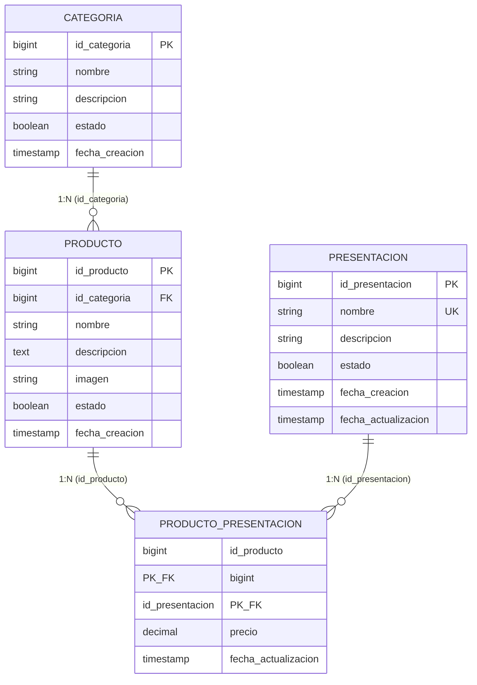

# CU7 — Paso 1: Base de Datos, Migraciones y Permisos RBAC

Este documento contiene el modelo relacional exacto, las 4 migraciones de base de datos y el seeder de permisos para el **CU7: Gestionar Productos y Presentaciones**.

---

## 1. Modelo Relacional



### Explicación de las Relaciones y Atributos:
1. **`categoria` $\xrightarrow{1:N}$ `producto`**:
   - Una categoría agrupa múltiples productos (ej. *Tortas, Postres Fríos, Galletas*).
   - Posee `nombre`, `descripcion`, `estado` (boolean para activar/desactivar) y `fecha_creacion`.
   - `producto` roba la llave foránea **`id_categoria`** referenciando a `categoria.id_categoria`.
2. **`producto`**:
   - Representa el producto base (ej. *Torta Selva Negra*, *Pie de Limón*).
   - Posee `nombre`, `descripcion`, `imagen` (ruta/URL de la fotografía), `estado` y `fecha_creacion`.
3. **`presentacion`**:
   - Catálogo maestro de presentaciones reutilizables (ej. *"Porción Individual"*, *"Torta Entera 1 Kg"*, *"Caja x 6 unidades"*).
   - Posee `nombre` (único), `descripcion`, `estado`, `fecha_creacion` y `fecha_actualizacion`.
4. **`producto` $\xleftrightarrow{N:M}$ `presentacion`** $\implies$ **`producto_presentacion`**:
   - Resuelve la relación de muchos a muchos entre productos y presentaciones.
   - **PK Compuesta**: `(id_producto, id_presentacion)`.
   - **FK `id_producto`**: Referencia a `producto.id_producto` (onDelete cascade).
   - **FK `id_presentacion`**: Referencia a `presentacion.id_presentacion` (onDelete restrict).
   - **Atributo `precio`**: Decimal con restricción `precio > 0`, específico para esa combinación.
   - **Atributo `fecha_actualizacion`**: Registra cuándo se modificó por última vez el precio o asignación de esa presentación.

---

## 2. Archivos a Crear / Modificar

| Acción | Ruta del Archivo | Propósito |
| :--- | :--- | :--- |
| **[CREAR]** | `backend/database/migrations/2026_09_03_000001_create_categoria_table.php` | Tabla `categoria` con `estado` y `fecha_creacion`. |
| **[CREAR]** | `backend/database/migrations/2026_09_03_000002_create_producto_table.php` | Tabla `producto` con FK `id_categoria`, `imagen`, `estado` y `fecha_creacion`. |
| **[CREAR]** | `backend/database/migrations/2026_09_03_000003_create_presentacion_table.php` | Tabla `presentacion` (catálogo) con `estado` y timestamps. |
| **[CREAR]** | `backend/database/migrations/2026_09_03_000004_create_producto_presentacion_table.php` | Tabla asociativa con PK compuesta `[id_producto, id_presentacion]`, `precio` y `fecha_actualizacion`. |
| **[CREAR]** | `backend/database/seeders/ProductosInicialSeeder.php` | Permisos RBAC y asignación al rol Administrador. |
| **[MODIFICAR]** | `backend/database/seeders/DatabaseSeeder.php` | Inclusión del seeder de productos. |

---

## 3. Detalle de Migraciones

### 3.1. Migración: `categoria`
```php
<?php

use Illuminate\Database\Migrations\Migration;
use Illuminate\Database\Schema\Blueprint;
use Illuminate\Support\Facades\Schema;

return new class extends Migration
{
    public function up(): void
    {
        Schema::create('categoria', function (Blueprint $table) {
            $table->bigIncrements('id_categoria');
            $table->string('nombre', 100);
            $table->string('descripcion', 255)->nullable();
            $table->boolean('estado')->default(true);

            $table->timestamp('fecha_creacion')->useCurrent();
        });
    }

    public function down(): void
    {
        Schema::dropIfExists('categoria');
    }
};
```

### 3.2. Migración: `producto`
```php
<?php

use Illuminate\Database\Migrations\Migration;
use Illuminate\Database\Schema\Blueprint;
use Illuminate\Support\Facades\Schema;

return new class extends Migration
{
    public function up(): void
    {
        Schema::create('producto', function (Blueprint $table) {
            $table->bigIncrements('id_producto');

            $table->unsignedBigInteger('id_categoria');
            $table->foreign('id_categoria')
                ->references('id_categoria')
                ->on('categoria')
                ->onDelete('restrict');

            $table->string('nombre', 150);
            $table->text('descripcion')->nullable();
            $table->string('imagen', 255)->nullable();
            $table->boolean('estado')->default(true);

            $table->timestamp('fecha_creacion')->useCurrent();
        });
    }

    public function down(): void
    {
        Schema::dropIfExists('producto');
    }
};
```

### 3.3. Migración: `presentacion`
```php
<?php

use Illuminate\Database\Migrations\Migration;
use Illuminate\Database\Schema\Blueprint;
use Illuminate\Support\Facades\Schema;

return new class extends Migration
{
    public function up(): void
    {
        Schema::create('presentacion', function (Blueprint $table) {
            $table->bigIncrements('id_presentacion');
            $table->string('nombre', 150)->unique();
            $table->string('descripcion', 255)->nullable();
            $table->boolean('estado')->default(true);

            $table->timestamp('fecha_creacion')->useCurrent();
            $table->timestamp('fecha_actualizacion')->useCurrent();
        });
    }

    public function down(): void
    {
        Schema::dropIfExists('presentacion');
    }
};
```

### 3.4. Migración: `producto_presentacion`
```php
<?php

use Illuminate\Database\Migrations\Migration;
use Illuminate\Database\Schema\Blueprint;
use Illuminate\Support\Facades\DB;
use Illuminate\Support\Facades\Schema;

return new class extends Migration
{
    public function up(): void
    {
        Schema::create('producto_presentacion', function (Blueprint $table) {
            $table->unsignedBigInteger('id_producto');
            $table->unsignedBigInteger('id_presentacion');

            $table->decimal('precio', 10, 2);
            $table->timestamp('fecha_actualizacion')->useCurrent();

            // Clave Primaria Compuesta
            $table->primary(['id_producto', 'id_presentacion'], 'pk_producto_presentacion');

            // Llaves Foráneas
            $table->foreign('id_producto')
                ->references('id_producto')
                ->on('producto')
                ->onDelete('cascade');

            $table->foreign('id_presentacion')
                ->references('id_presentacion')
                ->on('presentacion')
                ->onDelete('restrict');
        });

        // Restricción a nivel de BD para asegurar precio > 0
        DB::statement(
            'ALTER TABLE producto_presentacion
             ADD CONSTRAINT chk_producto_presentacion_precio
             CHECK (precio > 0)'
        );
    }

    public function down(): void
    {
        Schema::dropIfExists('producto_presentacion');
    }
};
```

---

## 4. Seeder de Permisos RBAC: `ProductosInicialSeeder.php`

```php
<?php

namespace Database\Seeders;

use App\Models\Permiso;
use App\Models\Rol;
use App\Models\RolPermiso;
use App\Models\Usuario;
use App\Models\UsuarioRolPermiso;
use Illuminate\Database\Seeder;

class ProductosInicialSeeder extends Seeder
{
    public function run(): void
    {
        $permisos = [
            [
                'nombre' => 'productos.gestionar_producto',
                'descripcion' => 'Permite gestionar productos y categorías del catálogo.',
            ],
            [
                'nombre' => 'productos.gestionar_presentacion',
                'descripcion' => 'Permite gestionar las presentaciones, asignaciones y precios de los productos.',
            ],
        ];

        $rolAdmin = Rol::where('nombre', 'Administrador')
            ->where('activo', true)
            ->first();

        foreach ($permisos as $datosPermiso) {
            $permiso = Permiso::updateOrCreate(
                ['nombre' => $datosPermiso['nombre']],
                [
                    'descripcion' => $datosPermiso['descripcion'],
                    'activo' => true,
                ]
            );

            if ($rolAdmin) {
                $rolPermiso = RolPermiso::firstOrCreate([
                    'rol_id' => $rolAdmin->id_rol,
                    'permiso_id' => $permiso->id_permiso,
                ]);

                // Asignar a los usuarios que ya tienen el rol Administrador
                $usuariosAdmin = Usuario::whereHas('usuarioRolPermisos.rolPermiso', function ($query) use ($rolAdmin) {
                    $query->where('rol_id', $rolAdmin->id_rol);
                })->get();

                foreach ($usuariosAdmin as $usuario) {
                    UsuarioRolPermiso::firstOrCreate([
                        'usuario_id' => $usuario->id_usuario,
                        'rol_permiso_id' => $rolPermiso->id_rol_permiso,
                    ]);
                }
            }
        }
    }
}
```

---

## 5. Comandos de Ejecución

Ejecutar dentro del contenedor backend:
```bash
docker compose exec backend php artisan migrate
docker compose exec backend php artisan db:seed --class=ProductosInicialSeeder
```

---

## 6. Criterios de Aceptación y Verificación

1. **Tablas creadas:** Las 4 tablas (`categoria`, `producto`, `presentacion` y `producto_presentacion`) existen en PostgreSQL con sus atributos exactos:
   - `categoria`: `id_categoria`, `nombre`, `descripcion`, `estado`, `fecha_creacion`.
   - `producto`: `id_producto`, `id_categoria`, `nombre`, `descripcion`, `imagen`, `estado`, `fecha_creacion`.
   - `presentacion`: `id_presentacion`, `nombre` (UK), `descripcion`, `estado`, `fecha_creacion`, `fecha_actualizacion`.
   - `producto_presentacion`: `id_producto` (FK), `id_presentacion` (FK), `precio`, `fecha_actualizacion`, con PK compuesta `(id_producto, id_presentacion)`.
2. **Check constraint activo:** `chk_producto_presentacion_precio` rechaza cualquier insert o update en `producto_presentacion` con precio `<= 0`.
3. **Permisos en BD:** La tabla `permisos` contiene `productos.gestionar_producto` y `productos.gestionar_presentacion`.
4. **Relación RBAC completa:** El rol `Administrador` y los usuarios administradores tienen vinculados los nuevos permisos en `rol_permiso` y `usuario_rol_permiso`.

> **Alto:** Una vez verificado el Paso 1 en PostgreSQL, proceder con el **Paso 2 (Modelos y Requests)**.
