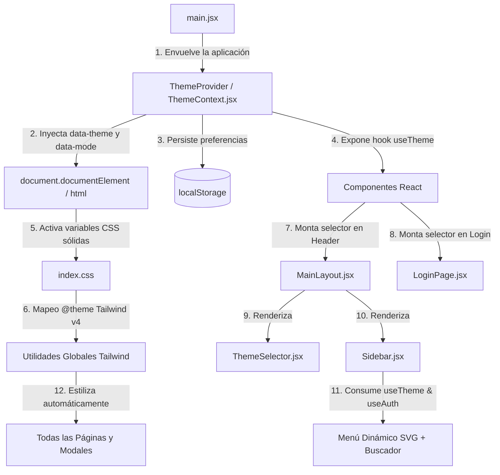

# Resumen CU23: Seleccionar Tema y Menú Dinámico

## Objetivo Completado
Se ha implementado con éxito el **CU23 | Seleccionar Tema**, cuyo propósito es dotar a todo el sistema web **Dulce Bocado** de:
1. Un **estilo único (CSS)** diseñado con **colores 100% sólidos (sin gradientes)**, garantizando armonía, accesibilidad y consistencia en todas las vistas, formularios, tablas y modales.
2. Al menos **3 temas visuales** según el público objetivo (**Niños**, **Jóvenes** y **Adultos**).
3. **Modo Día / Noche según el horario del cliente** (con evaluación horaria automática en tiempo real, selección manual y persistencia en `localStorage`).
4. Un **menú interactivo y dinámico** en el Sidebar que incluye búsqueda reactiva de módulos según permisos RBAC, colapso modular masivo, conteo de accesos e **iconos vectoriales SVG limpios** (sin emojis en los temas de Jóvenes y Adultos).

---

## Componentes y Archivos Implementados

### 1. Contexto Global de Temas y Modos
- **[`frontend/src/context/ThemeContext.jsx`](file:///c:/Materias_FINOR/TecnoWeb/Dulce-Bocado/frontend/src/context/ThemeContext.jsx):**
  - **Propósito:** Administra el estado global de la personalización visual de la aplicación.
  - **Gestión de Temas:** Soporta `'ninos'`, `'jovenes'` y `'adultos'`. Persiste la selección bajo la clave `dulce_bocado_theme` en `localStorage`.
  - **Gestión de Modos:** Soporta `'dia'`, `'noche'` y `'auto'`. Persiste la selección bajo la clave `dulce_bocado_mode` en `localStorage`.
  - **Detección Horaria Automática (`calcularModoHorario`):** Evalúa la hora local del dispositivo del cliente (`new Date().getHours()`).
    - **Día:** 07:00 a 18:59:59 hrs.
    - **Noche:** 19:00 a 06:59:59 hrs.
  - **Sincronización en Tiempo Real:** Dispone de un temporizador de 30 segundos que actualiza la hora local (`horaCliente`) y recalcula reactivamente el modo si el usuario tiene activado el modo `'auto'`.
  - **Inyección en el DOM:** Aplica automáticamente en el elemento raíz `document.documentElement` (`<html>`):
    - Atributo `data-theme="ninos|jovenes|adultos"`
    - Atributo `data-mode="dia|noche"`
    - Clase CSS `dark` cuando el modo efectivo es nocturno.

### 2. Sistema de Diseño CSS y Tokens Semánticos
- **[`frontend/src/index.css`](file:///c:/Materias_FINOR/TecnoWeb/Dulce-Bocado/frontend/src/index.css):**
  - **Propósito:** Define las variables CSS (`CSS Custom Properties`) para las 6 combinaciones posibles (3 temas x 2 modos lumínicos) usando exclusivamente colores sólidos planos.
  - **Mapeo Semántico en Tailwind CSS v4 (`@theme`):** Reasigna dinámicamente los tokens de color nativos de Tailwind (`--color-pink-50` a `--color-pink-800`, `--color-slate-50` a `--color-slate-900`, `--color-white`) a las variables semánticas activas (`--brand-500`, `--bg-app`, `--bg-surface`, `--border-color`, `--text-main`, etc.).
  - **Resultado:** Todos los componentes existentes de la aplicación (vistas de seguridad, ventas, pedidos, catálogo, inventario, modales, alertas y botones) se transforman de forma instantánea y armónica al cambiar de tema, sin requerir refactorizaciones manuales en cada página.
  - **Transiciones Globales:** Aplica transiciones suaves de color (`transition: background-color 0.2s, border-color 0.2s, color 0.2s`) para una experiencia de usuario fluida.

### 3. Componente Selector Visual Interactivo
- **[`frontend/src/components/ThemeSelector.jsx`](file:///c:/Materias_FINOR/TecnoWeb/Dulce-Bocado/frontend/src/components/ThemeSelector.jsx):**
  - **Propósito:** Menú desplegable flotante e intuitivo para que el usuario configure su experiencia visual.
  - **Características:**
    - Botón de activación con muestra de color del tema activo, icono SVG del modo actual y reloj digital con la hora local del cliente.
    - Panel de selección de los 3 temas con vista previa de muestras circulares de color sólido.
    - Selector de los 3 modos lumínicos (Día, Noche, Auto) con iconos vectoriales SVG limpios (Sol, Luna, Reloj).
    - Cierre automático al hacer clic fuera del componente (`click-outside`).

### 4. Menú Interactivo y Dinámico (Sidebar)
- **[`frontend/src/components/Sidebar.jsx`](file:///c:/Materias_FINOR/TecnoWeb/Dulce-Bocado/frontend/src/components/Sidebar.jsx):**
  - **Propósito:** Barra lateral de navegación dinámica y responsiva.
  - **Buscador en Tiempo Real:** Input interactivo para filtrar instantáneamente módulos y páginas autorizadas. Si el usuario escribe un término (ej. *"ped"*, *"usu"*, *"vent"*), las secciones coincidentes se expanden automáticamente.
  - **Acción Masiva:** Botón de un solo clic para "Expandir todo" o "Colapsar todo".
  - **Contador Dinámico:** Muestra la cantidad de módulos y resultados encontrados en tiempo real.
  - **Iconografía según Tema:**
    - **Jóvenes y Adultos:** Utiliza **iconos vectoriales SVG limpios y profesionales** (cero emojis) para cada sección (Inicio, Seguridad, Catálogo, Producción, Inventario, Ventas, Clientes, Compras, Reportes).
    - **Niños:** Muestra iconografía lúdica adaptada a su estilo infantil.

### 5. Integración en Vistas y Layouts
- **[`frontend/src/main.jsx`](file:///c:/Materias_FINOR/TecnoWeb/Dulce-Bocado/frontend/src/main.jsx):**
  - Envuelve toda la aplicación dentro del `<ThemeProvider>` en la raíz para garantizar disponibilidad global del contexto antes de montar la autenticación y las rutas.
- **[`frontend/src/layouts/MainLayout.jsx`](file:///c:/Materias_FINOR/TecnoWeb/Dulce-Bocado/frontend/src/layouts/MainLayout.jsx):**
  - Incorpora el `<ThemeSelector />` en la cabecera principal junto a los datos del usuario autenticado.
- **[`frontend/src/pages/LoginPage.jsx`](file:///c:/Materias_FINOR/TecnoWeb/Dulce-Bocado/frontend/src/pages/LoginPage.jsx):**
  - Integra el `<ThemeSelector />` en la cabecera superior del login, permitiendo a cualquier usuario o visitante previsualizar y elegir su tema preferido antes de iniciar sesión.

---

## Relación y Flujo de Datos entre Archivos

---

## Paletas de Colores Sólidos por Tema (6 Variantes)

| Tema | Modo Día (Light) - Colores Sólidos | Modo Noche (Dark) - Colores Sólidos | Radio Bordes | Acento Primario Sólido |
|---|---|---|---|---|
| **🧸 Niños** | **Fondo:** `#f0f9ff` (celeste suave) **Superficie:** `#ffffff` **Bordes:** `#7dd3fc` | **Fondo:** `#1e1b2e` (noche lila profundo) **Superficie:** `#28243d` **Bordes:** `#4c4470` | `rounded-3xl` (1.25rem) | Celeste Brillante (`#0284c7` / hover `#0369a1`) |
| **⚡ Jóvenes** | **Fondo:** `#f8fafc` (slate limpio) **Superficie:** `#ffffff` **Bordes:** `#cbd5e1` | **Fondo:** `#0f172a` (slate 900) **Superficie:** `#1e293b` (slate 800) **Bordes:** `#334155` | `rounded-2xl` (1.00rem) | Rosa Frambuesa (`#e11d48` / hover `#be123c`) |
| **☕ Adultos** | **Fondo:** `#f7f5f2` (lino arena suave) **Superficie:** `#ffffff` **Bordes:** `#d6ccbe` | **Fondo:** `#181513` (dark roast café) **Superficie:** `#24201c` **Bordes:** `#3e3730` | `rounded-xl` (0.75rem) | Chocolate Moka (`#7c4d2d` / hover `#623a1f`) |

---

## Lógica de Funcionamiento Paso a Paso

### 1. Carga Inicial del Sistema
1. Al cargar la aplicación, `ThemeProvider` verifica si existen preferencias guardadas en `localStorage` (`dulce_bocado_theme` y `dulce_bocado_mode`).
2. Si no existen, toma `'jovenes'` y `'auto'` como valores por defecto.
3. Si el modo es `'auto'`, ejecuta `calcularModoHorario()` tomando la hora local del cliente.
4. Establece los atributos `data-theme` y `data-mode` en la etiqueta `<html>`, activando inmediatamente los estilos en `index.css`.

### 2. Cambio de Tema o Modo por el Usuario
1. El usuario hace clic en el botón de personalización de la cabecera (en `MainLayout` o `LoginPage`).
2. Se despliega `ThemeSelector`, mostrando los 3 temas y los 3 modos disponibles con su estado actual y el reloj en vivo.
3. Al seleccionar un nuevo tema (ej. **Adultos**) o modo (ej. **Noche**):
   - `ThemeContext` actualiza su estado interno.
   - Guarda el nuevo valor en `localStorage`.
   - Modifica los atributos del DOM `data-theme="adultos"` y `data-mode="noche"`.
   - Todas las vistas cambian de color de forma fluida y continua mediante CSS nativo.

### 3. Uso del Menú Interactivo en el Sidebar
1. El usuario puede escribir en el campo de búsqueda del Sidebar (ej. *"ventas"*).
2. El componente filtra reactivamente las opciones autorizadas según los permisos RBAC del usuario autenticado.
3. Si hay coincidencias, expande automáticamente los módulos correspondientes y actualiza el contador de resultados.
4. Los iconos vectoriales SVG limpios se presentan adaptados al tema activo, garantizando un aspecto profesional.

---

## Estado en la Documentación del Proyecto
Se actualizó la tabla oficial de casos de uso en el archivo [`AGENTS.md`](file:///c:/Materias_FINOR/TecnoWeb/Dulce-Bocado/AGENTS.md) marcando el **CU23 | Seleccionar Tema** como `✅ COMPLETADO`.
