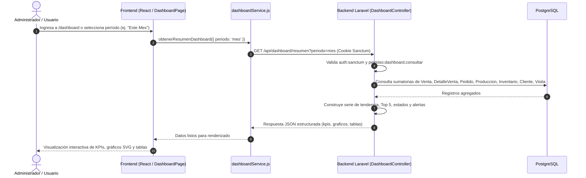

# Resumen CU24: Consultar Dashboard

## Objetivo Completado
Se ha implementado con éxito el **CU24 | Consultar Dashboard**, cuyo propósito es proporcionar a la administración y personal autorizado de **Dulce Bocado** una vista ejecutiva, consolidada y en tiempo real del estado integral del negocio. El panel reúne indicadores comerciales, operativos, de pedidos, producción e inventario sin incurrir en sobrearquitectura externa, utilizando componentes dinámicos nativos en React con gráficos SVG y Tailwind CSS.

---

## Componentes Implementados

### 1. Seguridad y Permisos (RBAC)
- **Permiso Oficial:** `dashboard.consultar`
  - Descripción: *"Permite consultar el dashboard administrativo y métricas consolidadas del sistema."*
- **Seeder de Permisos (`DashboardPermissionSeeder.php`):**
  - Registra el permiso en la tabla `permisos`.
  - Asigna la tupla correspondiente en la tabla intermedia `rol_permiso` para el rol **Administrador**.
  - Asigna automáticamente el permiso en `usuario_rol_permiso` para todos los usuarios que pertenecen al rol Administrador.
  - Integrado en el seeder maestro [DatabaseSeeder.php](file:///c:/Materias_FINOR/TecnoWeb/Dulce-Bocado/backend/database/seeders/DatabaseSeeder.php).

### 2. Controlador y Rutas (Backend Laravel)
- **Controlador ([DashboardController.php](file:///c:/Materias_FINOR/TecnoWeb/Dulce-Bocado/backend/app/Http/Controllers/Api/Dashboard/DashboardController.php)):**
  - **Filtro de Rango Temporal Dinámico:** Recibe el parámetro opcional `periodo` (`hoy`, `7d`, `mes`, `anio`, `personalizado`) y calcula los rangos exactos de fechas con Carbon.
  - **Cálculo de KPIs Agregados:**
    - `ventas_total`: Suma de ventas no anuladas en el período seleccionado.
    - `ventas_cantidad`: Número de transacciones comerciales completadas en el período.
    - `ventas_hoy`: Recaudación bruta generada en el día en curso.
    - `pedidos_activos`: Conteo de pedidos en curso (estados `PROGRAMADO` y `EN_PROCESO`).
    - `pedidos_en_proceso`: Conteo de pedidos listos o en preparación.
    - `pedidos_programados`: Conteo de pedidos agendados pendientes.
    - `produccion_activa`: Órdenes de producción en estado `PROGRAMADA` y `EN_PROCESO`.
    - `produccion_finalizada`: Órdenes completadas (`COMPLETADA`) en el período.
    - `alertas_stock`: Conteo de existencias de inventario en nivel crítico ($\le 5$ unidades).
    - `total_clientes`: Total de clientes registrados activos en la plataforma (`estado = true`).
    - `total_visitas`: Conteo acumulado de visitas registradas en el sistema (integrando CU22).
  - **Series y Gráficos:**
    - `tendencia_ventas`: Serie temporal calculada por franjas horarias (para `hoy`), por días (para `7d` y `mes`) o por meses (para `anio`).
    - `top_productos`: Ranking Top 5 de productos y presentaciones con mayor cantidad de unidades vendidas y montos recaudados.
    - `estados_pedidos`: Distribución agrupada de pedidos por estado (`PROGRAMADO`, `EN_PROCESO`, `ENTREGADO`, `CANCELADO`).
    - `almacenes`: Resumen consolidado por almacén (*Materias Primas, Producción, Mostrador*) con conteo de ítems, stock total y alertas críticas.
  - **Monitoreo Operativo Rápido:**
    - `proximos_pedidos`: Listado de los siguientes 5 pedidos por fecha y hora de entrega con saldo pendiente.
    - `ultimas_ventas`: Detalle de las últimas 5 ventas con cliente, vendedor, fecha y monto.
    - `stock_bajo`: Listado prioritario de hasta 6 insumos o presentaciones con existencias críticas.
- **Rutas API ([routes/api.php](file:///c:/Materias_FINOR/TecnoWeb/Dulce-Bocado/backend/routes/api.php)):**
  - `GET /api/dashboard/resumen`: Protegido por los middlewares `auth:sanctum` y `permiso:dashboard.consultar`.

### 3. Servicio y Componentes (Frontend React)
- **Servicio API ([dashboardService.js](file:///c:/Materias_FINOR/TecnoWeb/Dulce-Bocado/frontend/src/services/dashboardService.js)):**
  - Función `obtenerResumenDashboard(params)` que realiza peticiones HTTP autenticadas con `credentials: 'include'`.
- **Componentes Visuales de Dashboard:**
  - [DashboardKpiCard.jsx](file:///c:/Materias_FINOR/TecnoWeb/Dulce-Bocado/frontend/src/components/dashboard/DashboardKpiCard.jsx): Tarjeta modular para métricas clave, con variantes semánticas (*primary, success, warning, info, purple, amber*), badges informativos y estado skeleton de carga (`animate-pulse`).
  - [GraficoTendenciaVentas.jsx](file:///c:/Materias_FINOR/TecnoWeb/Dulce-Bocado/frontend/src/components/dashboard/GraficoTendenciaVentas.jsx): Gráfico reactivo en SVG puro que renderiza barras con degradado, líneas guía y tooltips interactivos con monto y conteo al pasar el cursor.
  - [GraficoTopProductos.jsx](file:///c:/Materias_FINOR/TecnoWeb/Dulce-Bocado/frontend/src/components/dashboard/GraficoTopProductos.jsx): Gráfico de barras horizontales con medallas de ranking (🥇, 🥈, 🥉), barras de progreso proporcionales y detalle monetario.
  - [GraficoEstadosPedidos.jsx](file:///c:/Materias_FINOR/TecnoWeb/Dulce-Bocado/frontend/src/components/dashboard/GraficoEstadosPedidos.jsx): Gráfico tipo Donut en SVG con cálculo trigonométrico de circunferencias (`strokeDasharray`/`strokeDashoffset`), centro con total y leyenda interactiva con porcentajes.
- **Página Principal ([DashboardPage.jsx](file:///c:/Materias_FINOR/TecnoWeb/Dulce-Bocado/frontend/src/pages/dashboard/DashboardPage.jsx)):**
  - Orquesta los selectores de período temporal (*Hoy ☀️, Últimos 7 Días 📅, Este Mes 📊, Todo el Año 📈*), botón de recarga en tiempo real, 5 tarjetas de KPIs principales, gráficos analíticos y tablas de control rápido con enlaces directos a los módulos de ventas, pedidos e inventario.
- **Página de Inicio ([InicioPage.jsx](file:///c:/Materias_FINOR/TecnoWeb/Dulce-Bocado/frontend/src/pages/InicioPage.jsx)):**
  - Añadida una tarjeta destacada con botón directo **"Abrir Dashboard →"** visible para usuarios con el permiso `dashboard.consultar`.
- **Rutas y Menú ([App.jsx](file:///c:/Materias_FINOR/TecnoWeb/Dulce-Bocado/frontend/src/App.jsx) y [Sidebar.jsx](file:///c:/Materias_FINOR/TecnoWeb/Dulce-Bocado/frontend/src/components/Sidebar.jsx)):**
  - Registrada la ruta protegida `/dashboard` bajo `<ProtectedRoute permiso="dashboard.consultar" />`.
  - Integrada en la sección **Reportes** (📊) del menú lateral dinámico.

---

## Lógica de Funcionamiento Paso a Paso



1. **Autenticación y Control de Acceso:**  
   El usuario inicia sesión. El backend retorna su colección de permisos (incluyendo `dashboard.consultar`). El `Sidebar` habilita la opción **Dashboard** y el `ProtectedRoute` autoriza la ruta `/dashboard`.
2. **Selección del Período:**  
   El usuario puede conmutar entre los períodos preestablecidos (*Hoy, 7 Días, Mes, Año*).
3. **Consolidación en Tiempo Real:**  
   El controlador de Laravel procesa las consultas agregadas en PostgreSQL, excluyendo ventas anuladas y agrupando adecuadamente según la escala temporal.
4. **Renderizado Responsivo y Temático:**  
   El frontend dibuja los gráficos SVG vectoriales y las tarjetas de datos utilizando los tokens de color del sistema de diseño unificado, garantizando legibilidad en los 3 temas (*Niños, Jóvenes, Adultos*) y modos (*Día / Noche*).

---

## Estructura del Payload JSON (`GET /api/dashboard/resumen`)

```json
{
  "periodo": {
    "clave": "mes",
    "fecha_inicio": "2026-09-01",
    "fecha_fin": "2026-09-30",
    "descripcion": "Septiembre 2026"
  },
  "kpis": {
    "ventas_total": 12450.00,
    "ventas_cantidad": 38,
    "ventas_hoy": 450.00,
    "pedidos_activos": 8,
    "pedidos_en_proceso": 3,
    "pedidos_programados": 5,
    "produccion_activa": 2,
    "produccion_finalizada": 14,
    "alertas_stock": 3,
    "total_clientes": 25,
    "total_visitas": 1540
  },
  "graficos": {
    "tendencia_ventas": [
      { "clave": "2026-09-01", "etiqueta": "Mar 01/09", "total": 850.0, "cantidad": 3 }
    ],
    "top_productos": [
      { "id_producto_presentacion": 1, "nombre": "Torta Selva Negra (Grande)", "producto": "Torta Selva Negra", "presentacion": "Grande", "unidades": 24, "monto": 3600.0 }
    ],
    "estados_pedidos": [
      { "estado": "PROGRAMADO", "cantidad": 5, "monto": 1200.0 },
      { "estado": "EN_PROCESO", "cantidad": 3, "monto": 750.0 }
    ],
    "almacenes": [
      { "id_almacen": 1, "nombre": "Materias Primas", "total_items": 15, "stock_critico": 1, "stock_total": 350.5 }
    ]
  },
  "tablas": {
    "ultimas_ventas": [],
    "proximos_pedidos": [],
    "stock_bajo": []
  }
}
```

---

## Estado en la Documentación del Proyecto
Se actualizó la tabla oficial de casos de uso en el archivo [AGENTS.md](file:///c:/Materias_FINOR/TecnoWeb/Dulce-Bocado/AGENTS.md) marcando el **CU24 | Consultar Dashboard** como `✅ COMPLETADO`.
